# ✨ 知行域 - 知行合一的智慧新世界

> 创新型AI智能学习与知识服务平台
>
> 作者：**程序员cc**
>
> 仓库地址：
> - 前端：https://github.com/ZZC-cc/Insight_Sphere-ZhiXingYu-Web
> - 后端：https://github.com/ZZC-cc/Insight_Sphere-ZhiXingYu

## 🌌 项目概述 (Introduction)

### 项目简介

知行域是一个集知识获取、实践应用和个性化学习于一体的智能平台，旨在帮助用户实现知行合一，突破认知边界。

### 项目愿景与理念

- 🌟 **知**：象征智慧的启迪，点亮用户的思维，为他们提供便捷的知识获取途径。
- 🌟 **行**：代表实践的力量，通过工具和交互助力用户将知识转化为行动。
- 🌟 **域**：象征开放与无限可能，为用户构建一个高效、智能、个性化的学习与交易空间。
- 🌟 **知行合一**：将知识与实践完美结合，为用户提供更便捷、更高效的学习体验。

> 🚀 在知行域，用户可以实现知行合一，突破认知边界，探索属于自己的智慧新世界。

### 项目概览

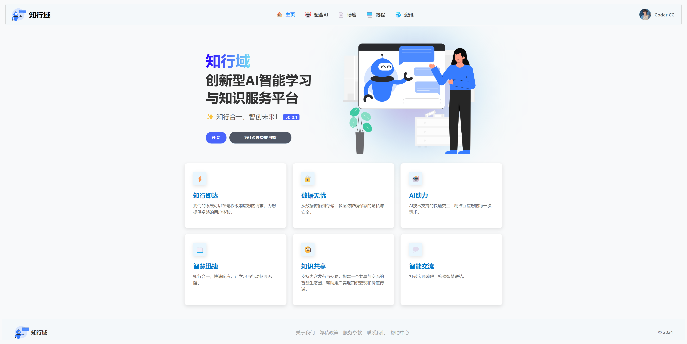
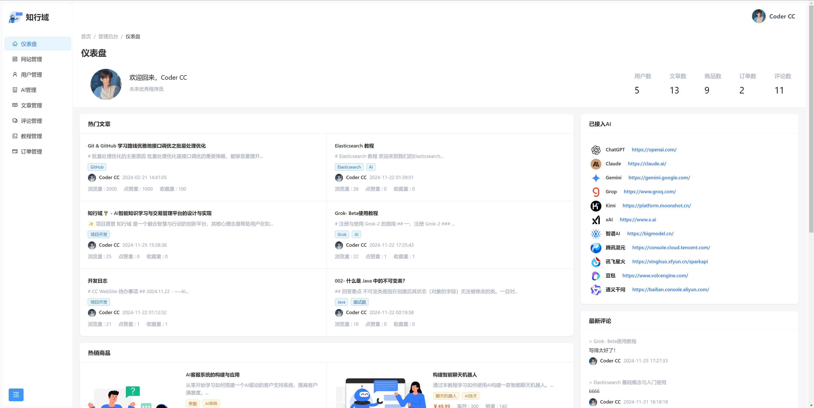

## 💻 技术栈 (Tech Stack)

| **类别** | **技术栈 (Tech Stack)**   | **说明 (Description)**   |
|--------|------------------------|------------------------|
| **后端** |                        |                        |
|        | ✅ Spring Boot          | 核心框架，用于构建 REST API 服务  |
|        | ✅ MyBatis-Plus         | 数据持久层框架，简化数据库操作        |
|        | ✅ JWT (JSON Web Token) | 用户身份认证与授权              |
|        | ✅ Swagger / OpenAPI    | API 文档生成与测试工具          |
|        | ✅ Logbok / Slf4j       | 日志记录与输出                |
|        | ✅ MySQL                | 数据存储与管理                |
|        | ✅ Elasticsearch        | 全文搜索与数据分析引擎            |
|        | ✅ Redis                | 缓存与分布式存储               |
| **前端** |                        |                        |
|        | ✅ Vue 3                | 前端框架，构建用户界面            |
|        | ✅ TypeScript           | JavaScript 超集，增强代码类型安全 |
|        | ✅ Vite                 | 前端构建工具，提升开发体验          |
|        | ✅ Ant Design Vue       | 前端 UI 组件库，构建高效界面       |
|        | ✅ Pinia                | Vue 3 状态管理工具           |
|        | ✅ Axios                | HTTP 客户端，用于数据请求        |
|        | ✅ UnoCSS               | 原子 CSS 框架，灵活管理样式       |

## 🚀 项目功能 (Features)

### 🤗用户模块功能 (User Features)

#### 1️⃣ **用户注册与登录**

**用户注册**

提供简洁直观的注册流程，帮助新用户快速完成账号创建：

> ✨ **亮点**：
> - 验证码实时发送，保证注册过程安全流畅。
> - 友好的交互设计，帮助用户快速上手。

* 用户可输入用户名、密码、手机号和邮箱地址，并通过 **邮箱验证码** 完成身份验证。
* 支持填写个人基本信息，如性别、地址和个人简介，个性化体验一键到位。
* **实时数据校验**：确保所有字段填写完整且符合规范。

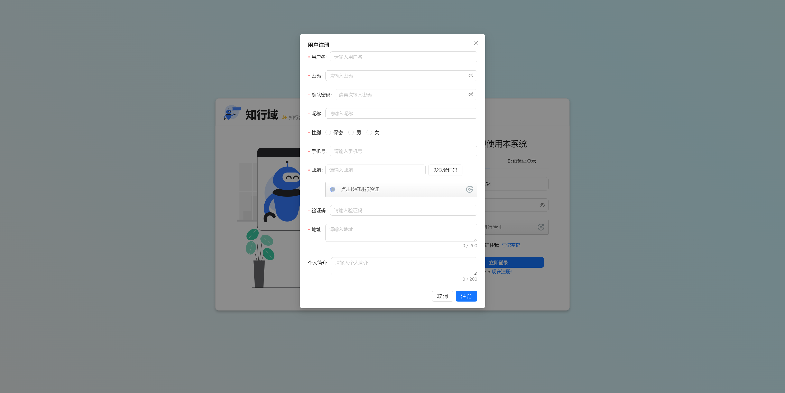

**用户登录**

> 🔒 **亮点**：
>    - 安全验证码机制，保护用户数据安全。
>    - 支持手机号、账号、邮箱登录。

登录页面设计简约，功能强大：

- 支持账号密码登录，结合安全验证码校验。
- 提供“记住密码”选项，便于频繁使用。
- 用户可快速找回密码，无需担心遗忘困扰。

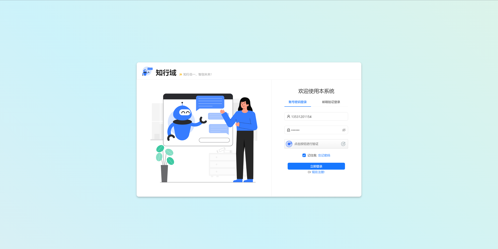

---

#### 2️⃣ **找回密码**

> 💡 **亮点**：
> - 简单明了的交互步骤，快速恢复访问权限。
> - 多层次验证机制，确保密码重置安全性。

- 提供便捷的找回密码功能，轻松解决忘记密码的尴尬：
    - 用户可输入注册邮箱获取 **验证码**，完成验证后重置密码。
    - 支持密码强度校验，保护账号安全。

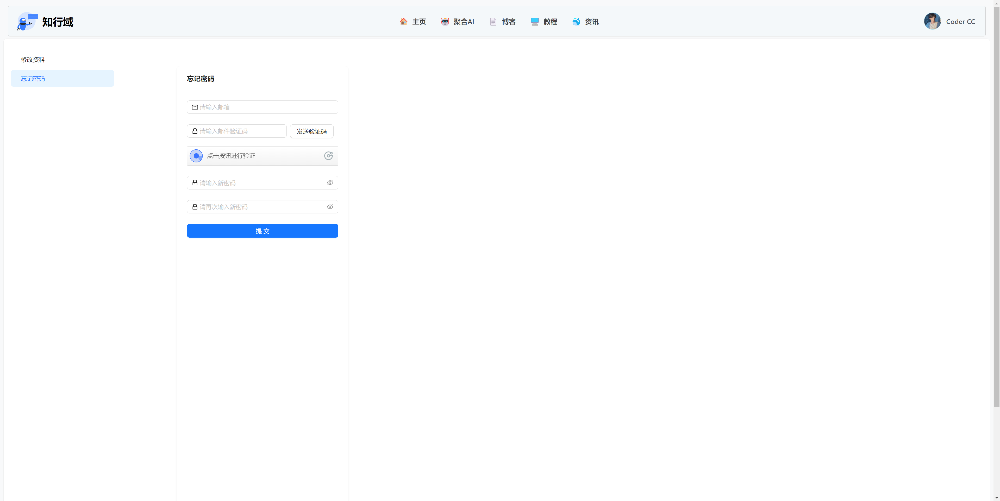

---

#### 3️⃣ **个人设置**

> 🖼️ **亮点**：
> - **实时反馈**：表单输入错误即时提示，提交更加高效。
> - 支持头像裁剪与上传，提升视觉美感。

- **修改个人资料**  
  用户可以自由更新以下信息，打造个性化账号：
    - 用户名、邮箱、手机号、地址等基础信息。
    - 上传头像，为账号注入个人特色。
    - 填写个人简介，展示专属自我。

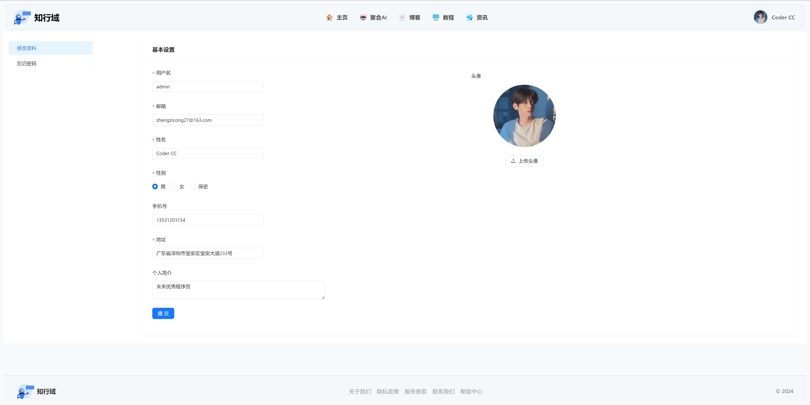

---

#### 4️⃣ **个人中心**

- **我的帖子**  
  集中管理用户发布的内容，支持以下功能：
    - 查看帖子阅读量、点赞数、评论数，内容影响力一目了然。
    - 帖子支持 **编辑** 和 **删除**，灵活调整展示内容。

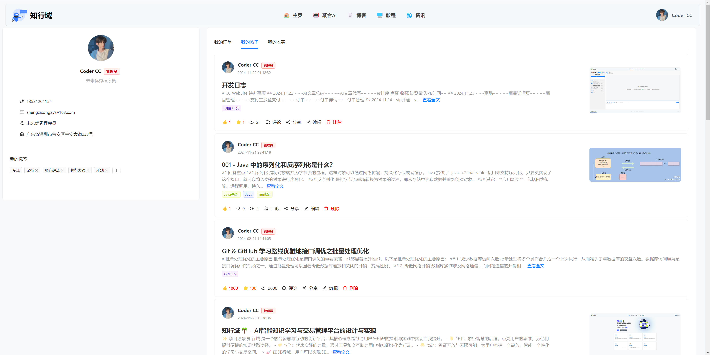

- **我的收藏**
    - 一键收藏感兴趣的内容（如帖子、教程等），快速保存，随时查看。
    - 集中管理收藏内容，简洁直观。

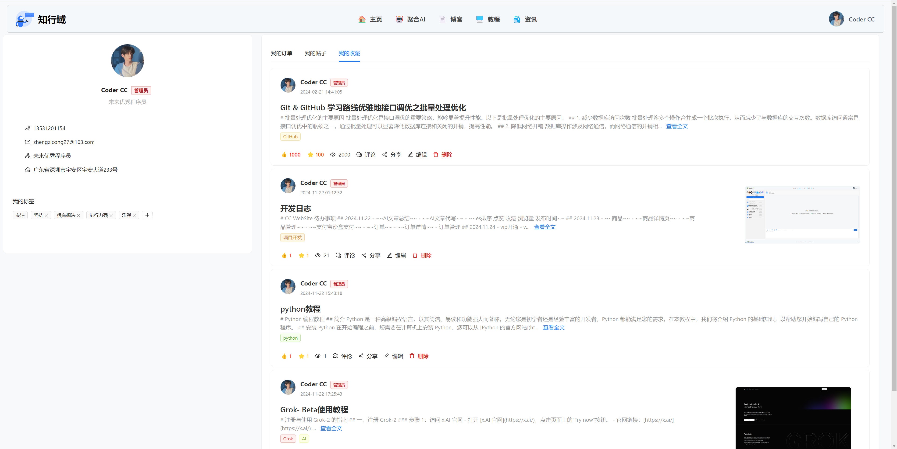

- **我的订单**  
  用户可查看订单详情，追踪购买记录：
    - **订单详情丰富**：包括订单号、商品信息、支付方式、订单状态等。
    - 点击查看商品详情，方便获取已购资源。

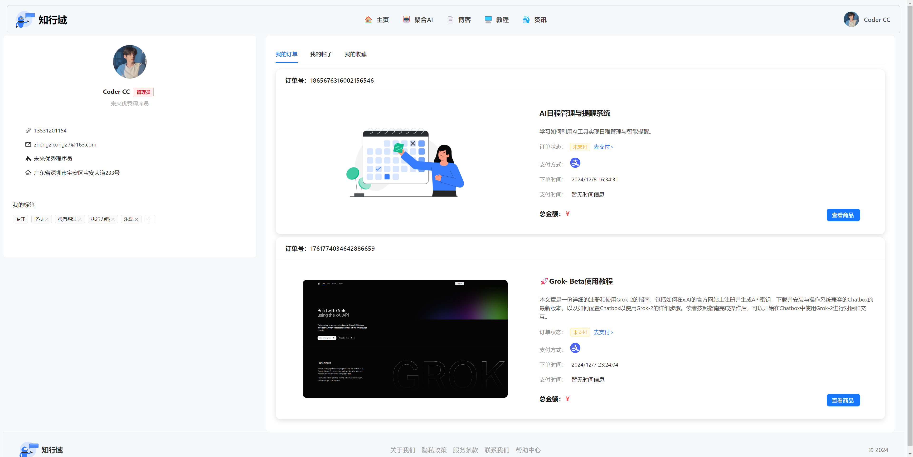

---

#### 5️⃣ **用户管理**

**用户信息查看**

> 📋 **亮点**：
> - 以表格形式直观展示用户信息，支持分页显示，便于查阅大量数据。
> - 提供快速搜索功能，管理员可根据用户名或其他字段精确定位用户。

管理员可通过用户管理模块查看所有用户的基本信息，包括：

- 用户头像、用户名、账号角色（例如普通用户、VIP用户、管理员等）。
- 性别、手机号、邮箱地址、地址信息等。
- 账号状态（正常/禁用）以及用户的创建时间和最近更新时间。

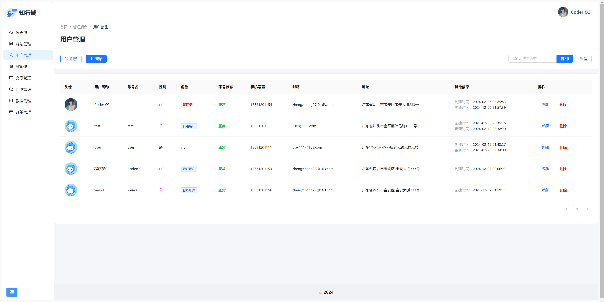

- **用户信息编辑**  
  管理员可以编辑用户的详细信息，包括：
    - 用户名、昵称、性别、角色、账号状态、手机号、邮箱地址、地址信息和个人简介。
    - 支持头像上传或更换功能，保证信息个性化与完整性。

- **用户删除**  
  管理员可以通过操作栏直接删除用户，快速移除无效或违规账号。

---

### 🤖聚合AI功能 (AI Aggregation)

#### 1️⃣ **聚合AI对话模块**

聚合AI模块为用户提供多平台智能交互体验，可随时切换不同的AI模型进行问答或生成内容。该模块的主要功能包括：

> 💡 **亮点**：
> - **任务指引**：模块提供推荐问题引导，帮助用户快速熟悉功能。
> - **多平台支持**：支持多个AI平台，为用户提供更丰富的交互体验。

**多平台支持**

- 支持主流AI模型平台，例如：ChatGPT、Claude、Gemini 等。用户可快速选择最适合任务的AI服务。
- 提供直观的模型切换界面，一键启动交互，无需繁琐配置。
  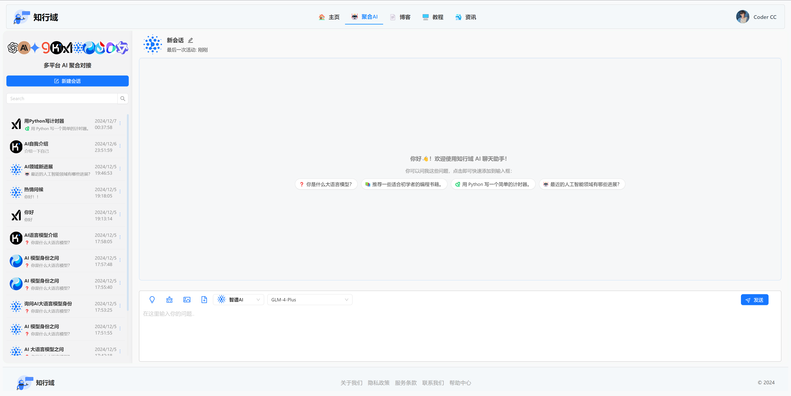

**实时交互**

- 用户可直接在聊天窗口输入问题，AI模型将实时响应，生成代码、回答问题或完成文本处理。
- 支持内容复制功能，便于用户保存和分享生成结果。
  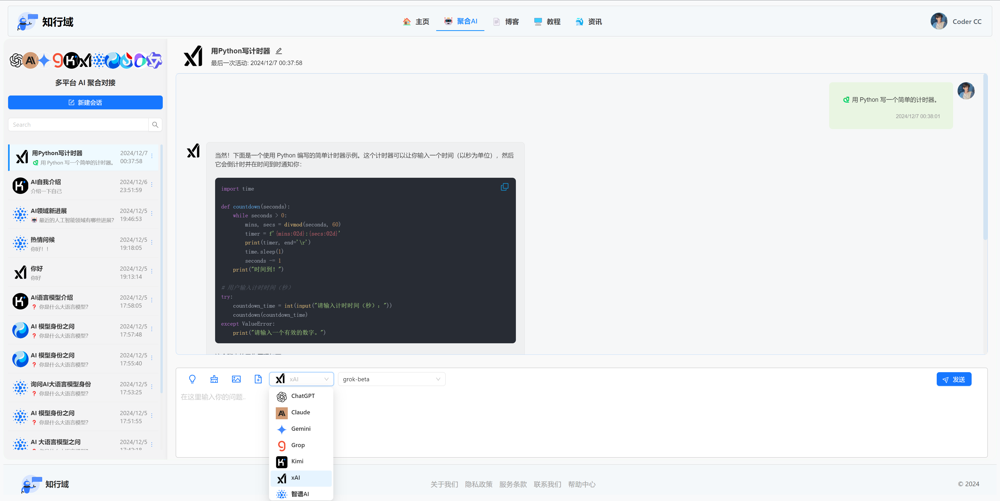

**可调参数**

- **温度 (temperature)：**  
  决定生成文本的创意性，值越高，生成结果越随机；值越低，生成结果更保守。
    - 说明：适合需要更具创造力或精确回答的场景切换。

- **核采样 (top_p)：**  
  另一种生成文本的方法，用于控制输出的多样性。
    - 说明：值越低，生成的内容更集中于高概率词汇。

- **最大生成长度 (maxTokens)：**  
  控制生成文本的最大token数量，避免生成过长或过短的内容。
    - 说明：适合对结果长度有严格要求的场景。

- **参数调整交互**
    - 通过滑块实时调整参数值，用户可清晰直观地设定目标。
    - 设置完成后点击“应用”，即刻生效，对当前对话产生影响。

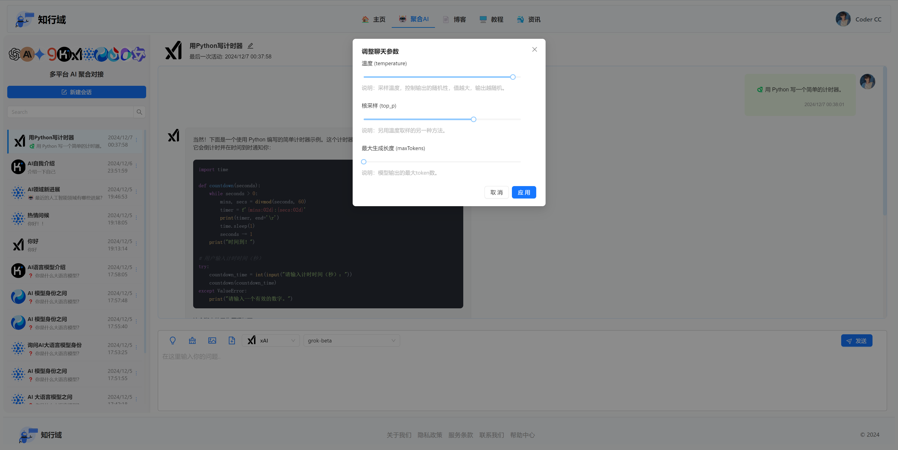

---

#### 2️⃣ **AI管理**

AI管理模块为管理员提供模型与平台的全面配置功能，实现多平台AI资源的高效管理和优化。主要功能包括：

> ✨ **亮点**：
> - 支持多种模型和平台配置，实现资源多样化。
> - 提供详细的模型参数设置，管理员可根据需求调整模型性能。

- **平台管理**
    - 支持添加新的AI平台，配置平台名称、简介、官网链接和 API 接口地址。
    - 管理员可查看、编辑或删除已配置平台，操作简单明了。

      
      

- **模型管理**
    - 支持为每个平台添加多个模型，管理员可配置模型名称、类型（文本/图像等）、上下文数量、最大输出长度、费用信息等。
    - 提供模型编辑与删除功能，满足灵活管理需求。

  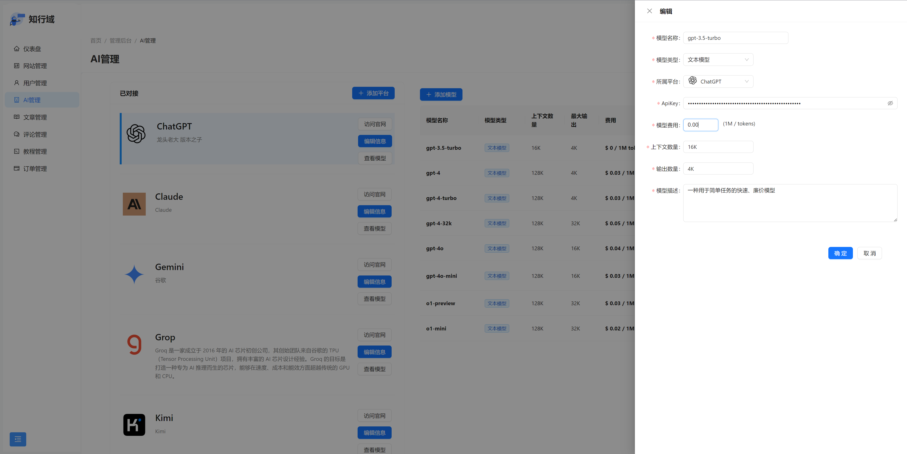

---

### ✍️ 博客模块功能 (Blog Features)

#### 1️⃣ **博客首页**

博客首页为用户提供了丰富的文章浏览与搜索功能，便于用户快速获取所需内容。

> ✨ **亮点**：
> - **关键词搜索**：支持根据关键词精确搜索文章，帮助用户快速定位内容。
> - **标签推荐**：热门标签一目了然，便于发现相关主题文章。

**主要功能**：

- **文章浏览**：  
  按最新、最热、最多点赞等分类展示文章，用户可快速找到感兴趣的内容。
- **快速搜索**：  
  支持关键词与标签联动搜索，高效筛选目标文章。
- **作者展示**：  
  在每篇文章旁展示作者信息，提升社区互动感。

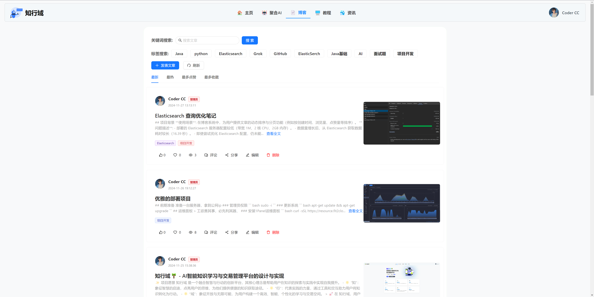

---

#### 2️⃣ **文章详情**

文章详情页提供了高质量的阅读体验与强大的交互功能，支持评论与分享。

> ✨ **亮点**：
> - **AI总结**：基于AI生成文章总结，快速获取核心内容。
> - **评论功能**：支持用户发表评论并与作者互动。

**主要功能**：

- **丰富的内容展示**：  
  支持多种文章排版格式，适配复杂内容展示。
- **AI总结**：  
  通过点击按钮，一键生成文章AI总结，便于快速了解文章主旨。
- **互动功能**：  
  用户可点赞、评论、分享或收藏文章，提升阅读体验。

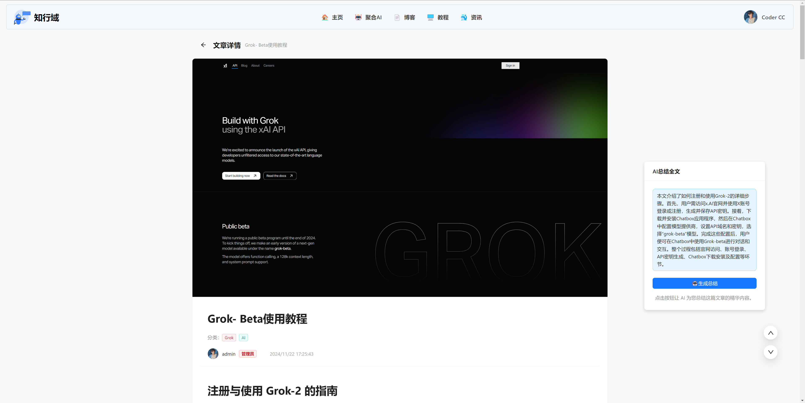  
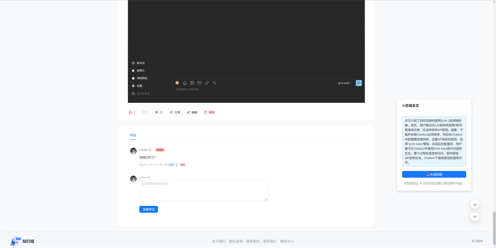

---

#### 3️⃣ **AI代写功能**

**快速创作**  
用户可通过博客模块的AI代写功能生成高质量文章，适合提升创作效率的场景。

> ✨ **亮点**：
> - **智能生成**：用户输入简单提示即可生成完整文章。
> - **即时预览**：生成结果实时显示，支持直接编辑与保存。

**功能展示**：

- **文章输入提示**：  
  用户仅需输入文章主题与大致内容需求，AI即可生成完整草稿。
- **生成与编辑**：  
  AI生成文章后支持即时编辑，用户可优化内容后直接发布。

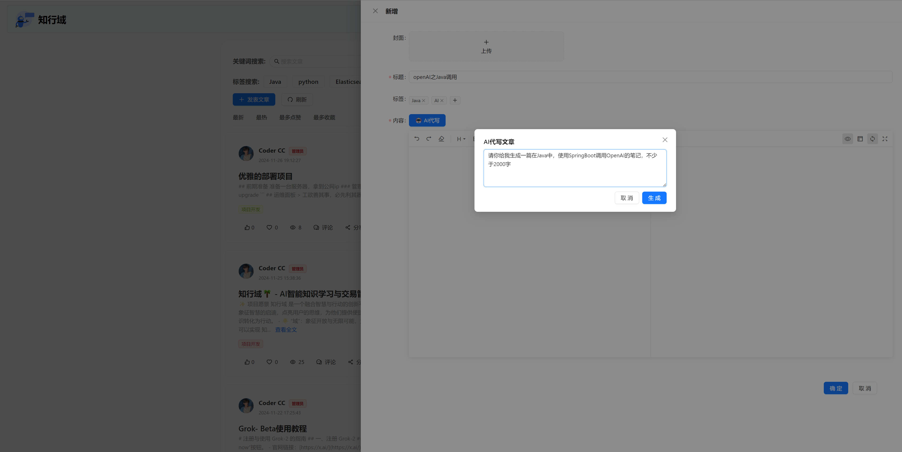  
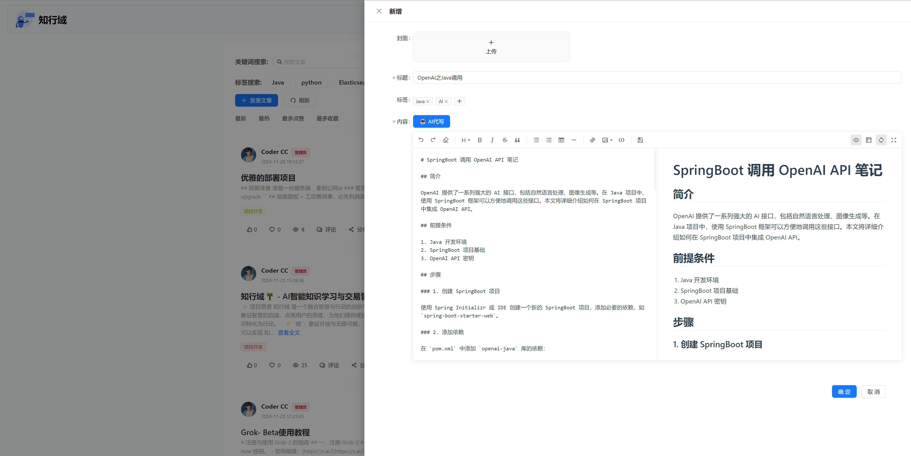

---

#### 4️⃣ **文章搜索**

博客模块提供了高效的搜索功能，支持多种方式快速定位目标内容。

> ✨ **亮点**：
> - **Elasticsearch集成**：实现高效的全文搜索，提升检索速度。
> - **高亮展示**：关键词命中内容高亮显示，便于快速查阅。

**功能展示**：

- **关键词搜索**：  
  用户输入关键词即可快速检索相关文章。
- **搜索结果高亮**：  
  检索结果中与关键词匹配的内容

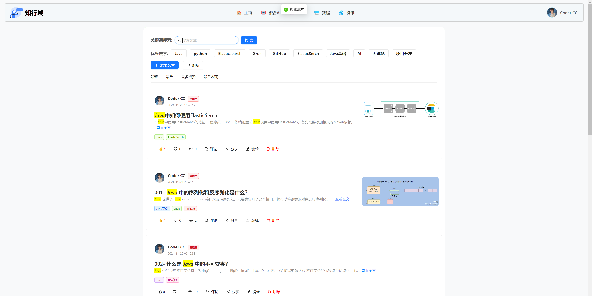

---

#### 5️⃣ **文章管理 (管理员功能)**

管理员可以高效管理博客文章，保持内容质量并优化用户体验。

> ✨ **亮点**：
> - 支持文章的全生命周期管理，包括创建、编辑、删除等操作。
> - 提供便捷的内容审核功能，确保文章符合社区规范。

**功能展示**：

- **文章查看**：  
  可浏览所有文章的标题、内容摘要、标签、创建用户及时间等详细信息。
- **快速编辑与删除**：  
  通过管理面板，管理员可快速编辑或删除文章。
- **高效搜索**：  
  支持通过关键词或标签筛选文章，提升管理效率。

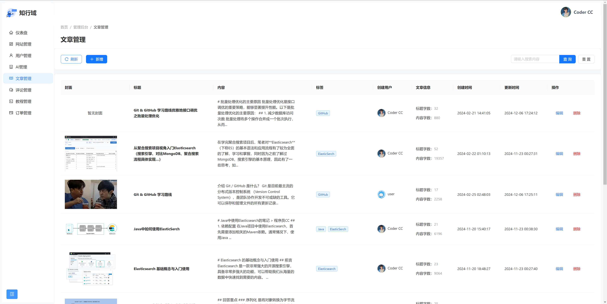

---

### 📘 教程模块功能 (Tutorial Module Features)

#### 1️⃣ **教程列表与详情**

**教程列表**

为用户展示最新、最热、和推荐的教学资源，支持丰富的筛选与搜索功能：

> ✨ **亮点**：
> - 支持关键字搜索与标签分类筛选，快速定位所需教程。
> - 响应式设计，兼容多种设备，方便随时学习。

- 用户可通过关键词和标签搜索感兴趣的教程。
- 每个教程包含 **封面图**、**标题**、**价格**、**作者信息** 和 **简介** 等关键信息。
- 教程状态标记清晰，包括 **免费**、**会员专属** 或 **付费** 标识。

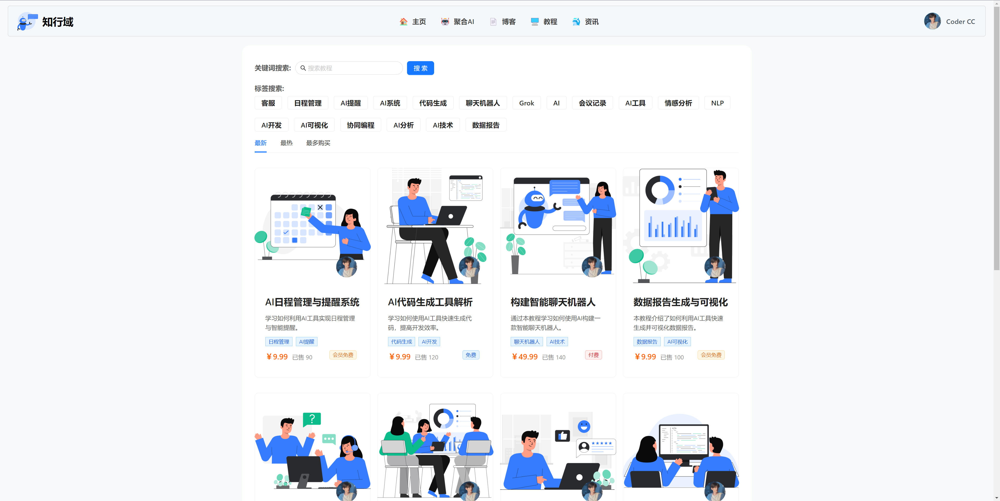

**教程详情**

> 📚 **亮点**：
> - 提供详细的课程内容介绍，包括课程目标、学习大纲等。
> - 支持用户评论功能，与社区共享学习心得。

- 用户可查看教程详情页面，包括课程简介、章节目录和学习内容。
- 提供直接购买或加入会员的快捷按钮，轻松获取学习资源。
- 评论区允许用户分享学习体验，增强社区互动。

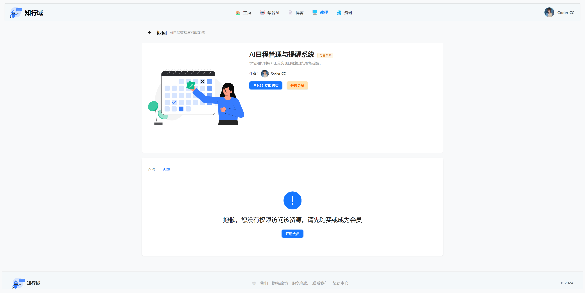
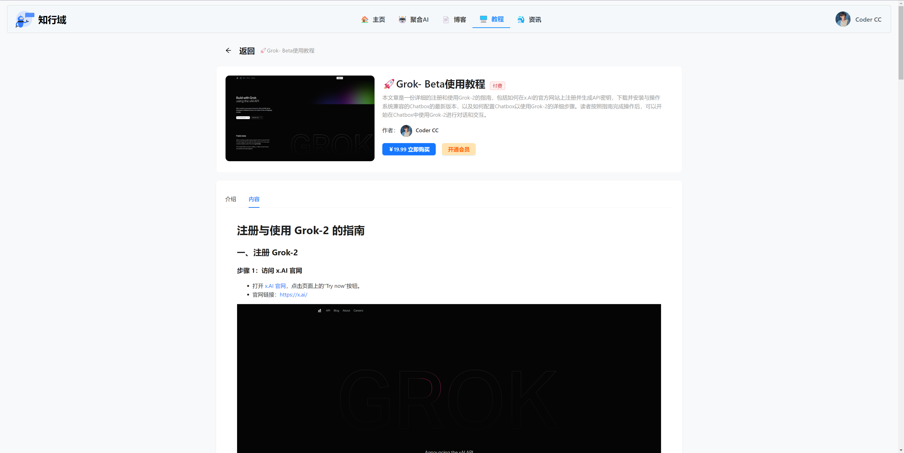

---

#### 2️⃣ **购买与支付功能**

支持多种支付方式，保障用户交易便捷与安全：

> 💳 **亮点**：
> - 沙盒支付测试，保证开发环境下的流畅交易体验。
> - 支持二维码支付及账户登录支付，适配多种使用场景。

**支付流程**

1. 用户选择课程后点击“立即购买”按钮，进入支付页面。
2. 可选择扫码支付或使用支付宝账号完成交易。
3. 支付成功后，自动跳转回教程页面并解锁所选资源。

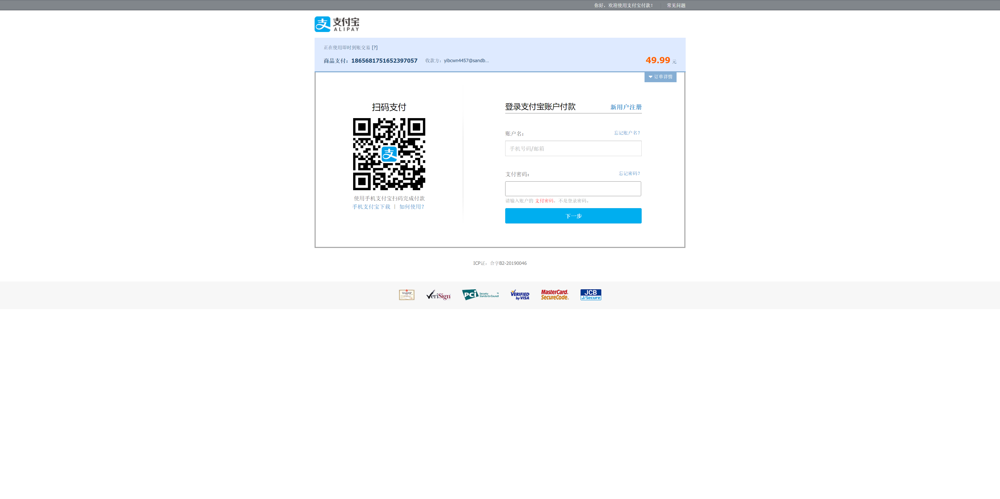
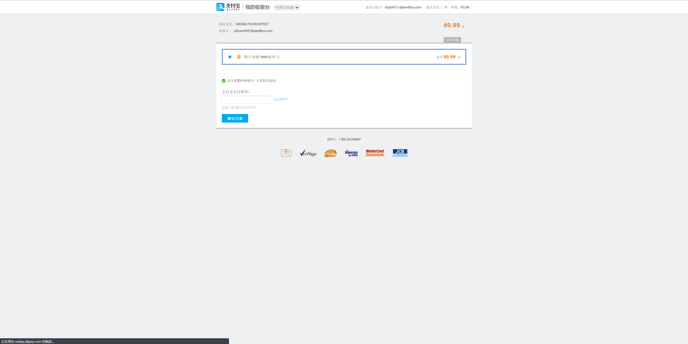

---

#### 3️⃣ **教程管理**

为管理员提供教程内容的集中管理功能，包括新增、编辑、删除和上下架操作：

> ⚙️ **亮点**：
> - 清晰的教程状态标识（上架/下架），便于掌控内容发布情况。

**管理功能**

- **新增教程**：支持上传封面图、输入标题、价格、标签和详细描述。
- **编辑教程**：管理员可随时调整教程内容和定价，保持课程的时效性与吸引力。
- **删除教程**：一键移除无效或过期内容，确保列表干净整洁。
- **上下架**：通过状态切换轻松管理教程的可见性。

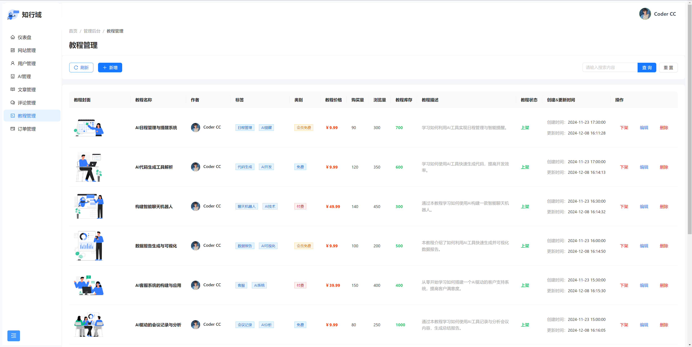

---

### 📦 订单模块功能 (Order Module Features)

#### 1️⃣ **个人中心订单管理**

**订单展示与详情**
> 🛒 **亮点**：
> - 简洁直观的订单信息呈现，便于用户快速查看。
> - 支持查看详细商品信息，追踪购买记录。

- 用户可在个人中心的订单管理页面查看已购买商品的详细信息，包括：
    - 商品名称、购买时间、支付金额、支付方式、订单编号等信息。
    - 点击查看商品详情，便于获取更多信息。

- **订单状态显示**
    - 订单状态分为“待支付”、“已支付”，状态清晰明了，方便用户了解当前订单进度。

---

#### 2️⃣ **后台订单管理**

> 📋 **亮点**：
> - 多维度筛选与管理订单，提高管理员效率。
> - 支持对订单进行删除操作，简化操作流程。

管理员可以通过订单管理模块查看平台所有订单的详细信息，包括：

- **订单信息**  
  包括订单编号、商品信息、支付金额、支付方式、订单状态、用户信息等。
- **管理操作**
    - 提供订单的删除功能，管理员可快速移除无效订单。
    - 支持按照订单状态、支付方式、用户手机号等条件查询订单，快速筛选。

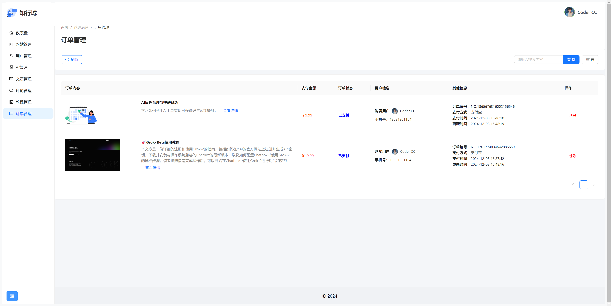

---

### 💬 评论模块功能 (Comment Module Features)

#### 1️⃣ **评论管理功能**

> 💡 **亮点**：
> - 支持管理员查看所有评论内容与详情。
> - 提供灵活的评论回复和删除功能。

- **评论展示**  
  管理员可在评论管理页面查看所有用户评论的详细信息，包括：
    - 评论用户、评论内容、评论文章、评论时间等。

- **评论操作**
    - **回复评论**  
      管理员可直接对用户评论进行回复，促进用户互动。
        - 支持输入回复内容后实时发布回复。  
          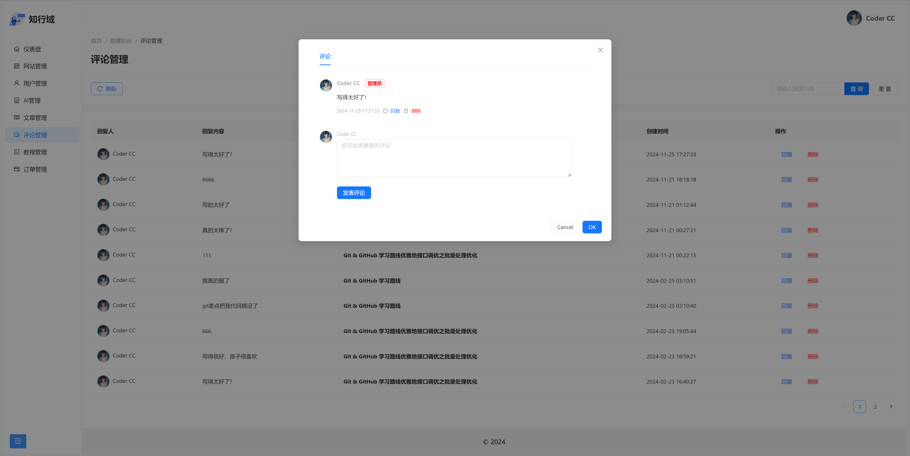

    - **删除评论**  
      一键删除违规或无效评论，保持评论区整洁。

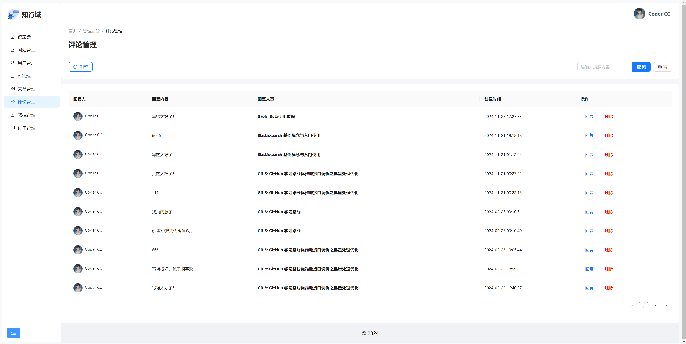

--- 
> 🔈本项目暂不考虑开源，sql文件和配置文件不公开，代码仅供学习参考~
>
> 如有需求，可联系作者获取源码。
>
> 联系方式：zhengzicong27@163.com

